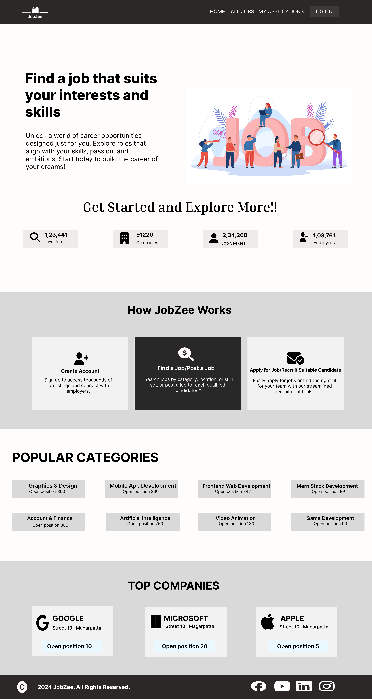

<h1>JobZee - Job Seekers and Contributors Platform</h1>

<strong>JobZee</strong> is a full-featured platform for job seekers to find opportunities and for recruiters and contributors to post job listings, connect with talent, and manage applications. Built on the MERN stack, JobZee provides a modern, intuitive interface designed to simplify the job search and recruitment process.

<h2 id="features">Features</h2>
<ul>
  <li><strong>Job Search and Filtering</strong>: Users can search for jobs by title, location, or skills.</li>
  <li><strong>Profile Creation</strong>: Job seekers can create profiles to showcase their skills and experience.They can also upload there CVs.</li>
  <li><strong>Job Posting for Contributors</strong>: Recruiters and contributors can post jobs, view applicants, and track the application process.</li>
  <li><strong>Application Tracking</strong>: Both job seekers and recruiters can follow up on application statuses.</li>
</ul>

<h2 id="ui-design">UI Design</h2>

Below is a preview of the homepage design created in Figma:

<h2 id="tech-stack">Tech Stack</h2>
<ul>
  <li><strong>Frontend</strong>: React, CSS</li>
  <li><strong>Backend</strong>: Node.js, Express</li>
  <li><strong>Database</strong>: MongoDB</li>
  <li><strong>Tools</strong>:
    <ul>
      <li><strong>npm</strong> - For managing project dependencies and scripts</li>
      <li><strong>Postman</strong> - For API testing and validation</li>
      <li><strong>Figma</strong> - For designing the homepage and UI layouts</li>
    </ul>
  </li>
</ul>

<h2 id="usage">Usage</h2>
<ul>
  <li><strong>Creating a Job Seeker Profile</strong>: Register, fill out your profile, and browse available jobs.</li>
  <li><strong>Job Posting for Contributors</strong>: Register as a contributor and post job listings.</li>
  <li><strong>Application Process</strong>: Apply to jobs and track your application status on the dashboard.</li>
</ul>
